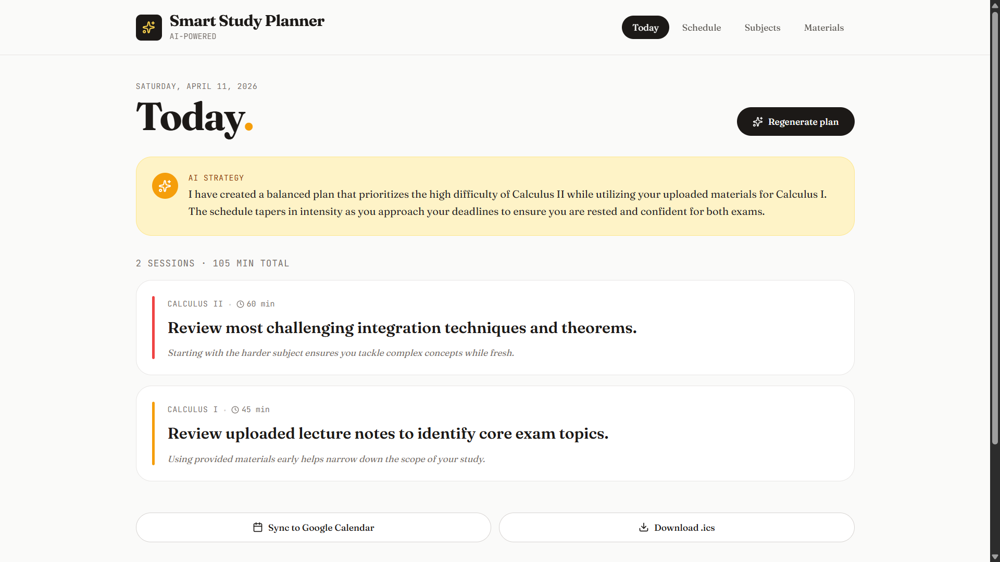
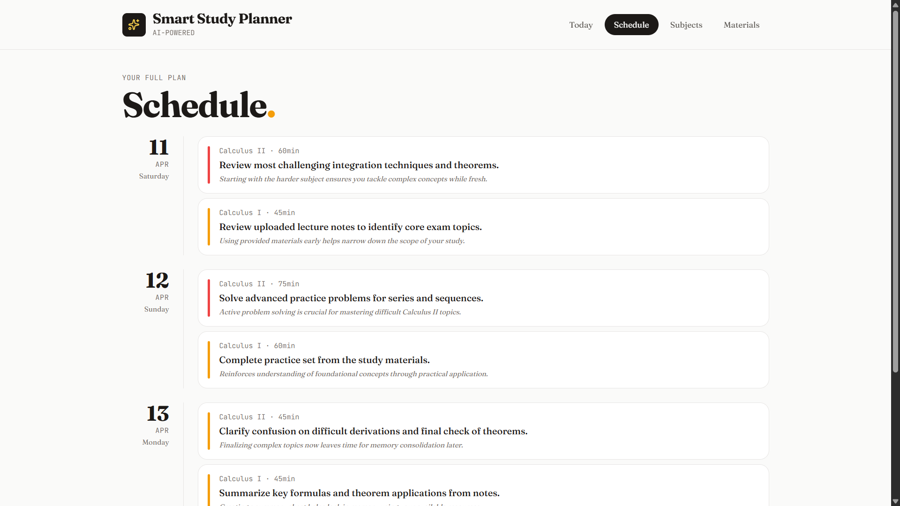
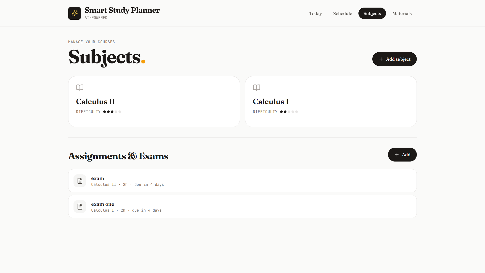
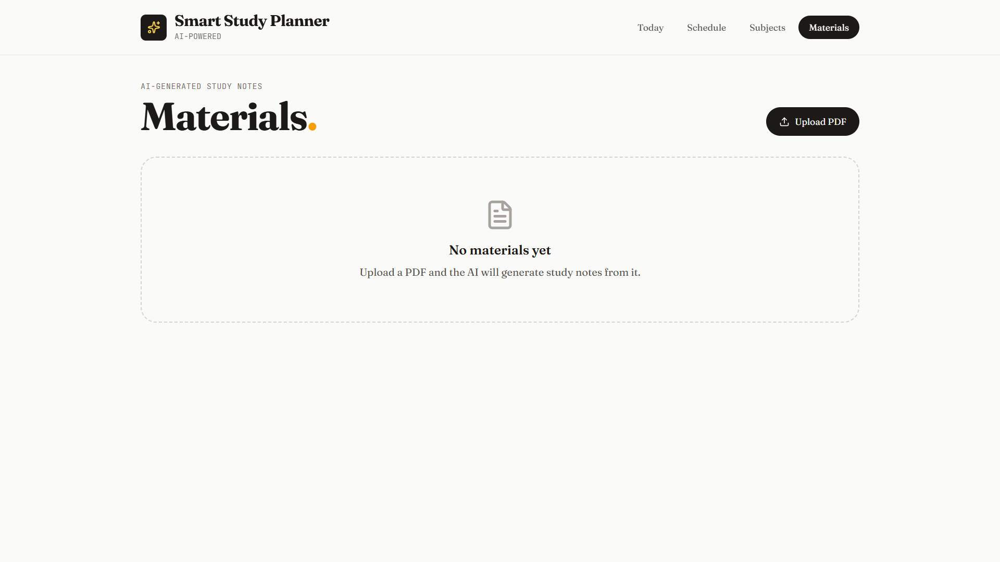

# Smart Study Planner

> An AI-powered study planning app that turns your assignments and deadlines into a clear, prioritized daily schedule — and transforms lecture PDFs into instant study notes.


---

## Overview

Most students already know what they have to do — they just don't know where to start. Smart Study Planner solves that by letting you enter your subjects, assignments, and exams, then using Google Gemini to generate a realistic 14-day study schedule with specific daily tasks, time estimates, priorities, and a short explanation of *why* each session is scheduled when it is.

There's no backend, no account required, and no data leaves your browser except for the Gemini API calls.

---

## Features

### 1. Subject & Assignment Management
Add courses with a difficulty rating (1–5), then track individual assignments, essays, exams, and projects with due dates and estimated hours.

### 2. AI Schedule Generation
Click "Generate plan" and Gemini builds a full 14-day study schedule from your course load. Each session includes a task description, duration, priority level, and the AI's reasoning for placing it on that day. The prompt enforces rules like spaced repetition, lighter days before exams, and never overscheduling.

### 3. Today View
Your current day's sessions shown front and center, color-coded by priority (high / medium / low), with the AI's overall strategy summary at the top so you know what the plan is trying to accomplish.

### 4. Local Persistence
Everything is saved to the browser's `localStorage` via a custom `useLocalStorage` hook. The app remembers all your data between sessions with no login or server needed. Data is stored under five keys: `ssp-view`, `ssp-subjects`, `ssp-assignments`, `ssp-materials`, and `ssp-schedule`.

### 5. Calendar Export (.ics)
Download your full schedule as a standard `.ics` iCalendar file with one click. Compatible with Google Calendar, Outlook, Apple Calendar, and any other calendar application.

### 6. PDF Upload + AI Notes
Upload a lecture or textbook PDF (up to 5 MB) and Gemini reads it directly. It returns a focused paragraph covering key concepts, areas to focus on, common mistakes to watch for, and a study tip — saved automatically to your materials list.

### 7. Google Calendar Integration
Open any of today's study sessions in Google Calendar with a single click. The event title, time, and description are pre-filled and ready to save. This uses link-based event creation rather than OAuth, which keeps the app simple and avoids requiring any account permissions.

---

## Screenshots

### Today View


### Full Schedule


### Subjects & Assignments


### AI Notes from PDF


---

## Tech Stack

| Layer | Technology |
|---|---|
| UI framework | React 18 (hooks only, no class components) |
| Build tool | Vite |
| Styling | Tailwind CSS |
| AI | Google Gemini (`gemini-flash-latest`) via `@google/generative-ai` |
| Icons | `lucide-react` |
| Storage | Browser `localStorage` (no backend) |

---

## Getting Started

### Prerequisites
- Node.js 18 or later
- A free Gemini API key from [aistudio.google.com](https://aistudio.google.com/)

### Installation

1. Clone the repository:
   ```bash
   git clone https://github.com/catoooos21/smart-study-planner.git
   cd smart-study-planner
   ```

2. Install dependencies:
   ```bash
   npm install
   ```

3. Get a Gemini API key and create your `.env.local` file:

   **Getting the key:**
   - Go to [aistudio.google.com](https://aistudio.google.com/) and sign in with a Google account.
   - Click **"Get API key"** in the left sidebar, then **"Create API key"**.
   - Copy the key that appears (it starts with `AIza...`).

   **Adding it to the project:**
   - In the `smart-study-planner` folder, create a new file called exactly `.env.local` (note the dot at the start — no other extension).
   - Open it in any text editor and paste this single line, replacing the placeholder with your actual key:
     ```
     VITE_GEMINI_API_KEY=AIzaSy...your_key_here
     ```
   - Save the file. You're done — this file is already in `.gitignore` so it will never be committed to GitHub.

   > **Why `VITE_` prefix?** Vite only exposes environment variables that start with `VITE_` to the browser. Without it, the key would be undefined at runtime.

4. Start the development server:
   ```bash
   npm run dev
   ```

5. Open [http://localhost:5173](http://localhost:5173) in your browser.

---

## How It Works

The app makes two types of Gemini API calls:

**Schedule generation.** When you click "Generate plan," the app assembles a structured JSON object with all your subjects, assignments, difficulty ratings, available hours, and which subjects have uploaded materials. This is sent to Gemini with a detailed system prompt that defines the output schema and enforces 10 planning rules. The model returns a JSON schedule which is parsed and written to localStorage.

**PDF notes.** When you upload a PDF, it is read in the browser as base64 and sent to Gemini as inline data. The model returns a single focused paragraph of study notes which is saved to your materials list.

The `.ics` export is built in plain JavaScript with no external library. The Google Calendar integration constructs event creation URLs with query parameters pre-filled — no OAuth flow, no server, no tokens.

---

## Project Structure

```
smart-study-planner/
├── src/
│   ├── App.jsx                  # Main app — all views and state
│   ├── main.jsx                 # React entry point
│   ├── index.css                # Tailwind imports
│   ├── hooks/
│   │   └── useLocalStorage.js   # Custom hook for persistent state
│   └── utils/
│       ├── icsExport.js         # iCalendar (.ics) file generator
│       └── googleCalendar.js    # Google Calendar URL builder
├── screenshots/                 # README screenshots
├── public/
├── .env.local                   # API key (not committed)
├── index.html
├── package.json
├── tailwind.config.js
└── vite.config.js
```

---

## Known Limitations

**Google Calendar uses link-based events, not OAuth.** Adding two-way sync via OAuth would require a consent screen, token refresh, and redirect URI setup — significant complexity for a feature where the link approach achieves the same result. This was a deliberate scoping decision.

**Single-user, single-device.** All data lives in `localStorage`, so it doesn't sync across devices. A production version would need a backend with authentication.

**5 MB PDF limit.** Files over 5 MB are rejected to stay within Gemini's inline data limits. Larger files would need to use Gemini's File API instead.

**No offline AI.** Schedule generation and PDF notes both require an internet connection and a valid API key.

---

Built as a school project. AI features powered by [Google Gemini](https://gemini.google.com/).
